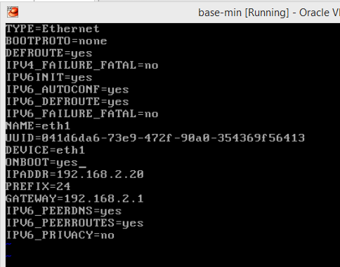

# openshift-lab
_OpenShift 3 virtual lab_

## Goals:
- [ ] Set up a Platform as a Service (PaaS) environment on a single laptop, using a virtual network of connected virtual machines
- [ ] Demonstrate a development/deployment workflow using the PaaS environment
- [ ] Demonstrate an Operational Management feature which monitors resources in the PaaS environment and lists all applications/services deployed in containers
- [ ] Use the experience gained from this lab to create a proposed architecture that can be used to build a PaaS environment in a corporate network

## Platform:
- Dell Precision M4800 laptop, Windows 10 64bit, 32GB RAM, Intel i7 2.80GHz, ~900GB SATA HDD

## Software needed:
- VirtualBox 5.0 (virtualbox.org, free)
- RedHat Enterprise Linux 7.1 (RHEL) (redhat.com, not free... requires redhat.com account and eval or valid license)
- RedHat OpenShift Enterprise 3.0 (redhat.com, not free)

## PaaS environment set up

### Creating a base virtual machine
1. Install VirtualBox 5.0
2. Create a new RedHat 64 bit virtual machine
  - 4GB RAM
  - 2 CPU Cores
  - 20GB HDD (for OS)
  - 100GB HDD (will be used for Docker repository)
  - 
  - 2 Network Adapters (one for internet access through host laptop, one for internal networking between multiple VMs)
  - Optional: Set up a port forwarding rule on adapter 1 for the SSH protocol (so that SSH can be used from host to guest VMs)
  - 
  - 
3. Download the RHEL 7.1 install image (iso file), attach it to the VM's optical drive and start the VM.
  - 
4. Follow the directions on-screen to install a minimum RHEL 7.1 server.
  - Select the 20GB hard drive as the install destination
  - Select "minimum install" under software configuration (optional: if you want to include a desktop GUI or other options, select those options during install)
  - Configure the two network adapters:
    - eth0: DHCP (Automatic), uses the host's network connection for internet
    - eth1: Manual, IP=192.168.2.20, Mask=255.255.255.0, GW=192.168.2.1, No DNS, No Routing
  - Set up the root password and a user account
  - Finish the install, and reboot
  - 
5. Add user "charlie" to the sudoers group ()
6. Configure both network interfaces to always be ON after boot (eth0 should be configured properly already, but you will need to edit eth1's configuration file):
  - sudo vi /etc/sysconfig/network-scripts/ifcfg-eth1
  - Change "ONBOOT" to "yes" (then restart your VM or "sudo ifup eth1")
  - 
7. Add entries to the /etc/hostnames file for this base server, and for two additional servers (which we will clone from this base machine)
  - 
8. Ping Google to verify internet access (ping www.google.com)
9. Prepare the server for the OpenShift install (Ref: )
  - Registering the host
    - '''# subscription-manager register --username=<user_name> --password=<password>'''
    - '''# subscription-manager list --available'''
    - (in the output of the previous command, find the pool ID for an OpenShift Enterprise subscription and attach it):
    - '''# subscription-manager attach --pool=<pool_id>'''
    - Disable all repositories and enable only the required ones:

'''# subscription-manager repos --disable="*"
# subscription-manager repos \
    --enable="rhel-7-server-rpms" \
    --enable="rhel-7-server-extras-rpms" \
    --enable="rhel-7-server-ose-3.0-rpms"
'''

    - install packages:
    - '''yum install wget git net-tools bind-utils iptables-services bridge-utils bash-completion'''
    - install packages needed for "quick install" script:
    - '''yum install gcc python-virtualenv'''
    - update packages:
    - '''yum update'''
    - Install Docker
    - '''yum install docker'''