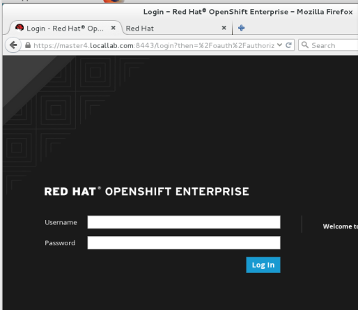

# openshift-lab
OpenShift 3 virtual lab set up instructions :shipit:

# Goals:
- [ ] Set up an OpenShift Platform as a Service (PaaS) environment on a single laptop, using a virtual network of connected virtual machines
- [ ] Demonstrate a development/deployment workflow using the PaaS environment

# Platform:
- Dell Precision M4800 laptop, Windows 10 64bit, 32GB RAM, Intel i7 2.80GHz, ~900GB SATA HDD

# Software needed:
- VirtualBox 5.0 (virtualbox.org, free)
- RedHat Enterprise Linux 7.1 (redhat.com, not free... requires redhat.com account and eval or valid license)
- RedHat OpenShift 3.0 (redhat.com, not free)

